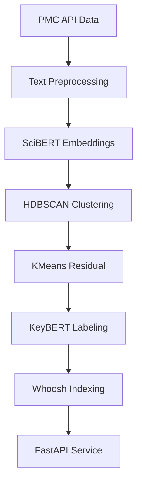

# PMB Clustering - Automated Scientific Article Clustering


**End-to-End Pipeline for Intelligent Clustering and Semantic Search of Scientific Literature**

A sophisticated ML pipeline that automatically processes, clusters, and indexes scientific articles from PubMed Central (PMC) using state-of-the-art NLP techniques and unsupervised learning.

---

## 🎯 Key Features

- **🔬 Scientific Text Processing** - Specialized preprocessing for academic literature
- **🧮 Contextual Embeddings** - SciBERT for domain-specific semantic representations
- **📊 Hybrid Clustering** - HDBSCAN + KMeans for robust topic discovery
- **🏷️ Automatic Labeling** - KeyBERT + TF-IDF for interpretable cluster labels
- **🔍 Semantic Search** - Whoosh-powered inverted index for efficient queries
- **🚀 Production API** - FastAPI backend with cloud deployment on Vercel

---

## 🏗️ System Architecture

### Pipeline Overview


### Technology Stack

| Component | Technologies | Purpose |
|-----------|--------------|---------|
| **Data Ingestion** | `pandas`, `httpx`, `asyncio` | Batch processing of PMC metadata & content |
| **NLP Preprocessing** | `spacy` (en_core_sci_sm), `nltk` | Scientific text cleaning & lemmatization |
| **Embedding Generation** | `transformers`, `SciBERT` | Domain-specific contextual embeddings |
| **Clustering Core** | `hdbscan`, `scikit-learn` | Density-based + centroid clustering |
| **Topic Labeling** | `keybert`, `TF-IDF` | Automated keyword extraction |
| **Search Engine** | `whoosh` | High-performance semantic search |
| **API & Deployment** | `fastapi`, `vercel` | RESTful API with cloud hosting |

---

## 📁 Project Structure

```
pmb-clustering/
│
├── app/
│   ├── main.py                      # FastAPI application entry point
│   ├── routers/
│   │   ├── process_data.py          # Data processing endpoints
│   │   ├── search.py               # Semantic search endpoints
│   │   └── clusters.py             # Cluster analysis endpoints
│   ├── services/
│   │   ├── preprocessing.py        # NLP pipeline & text cleaning
│   │   ├── vectorization.py        # SciBERT & TF-IDF embeddings
│   │   ├── clustering.py           # HDBSCAN + KMeans algorithms
│   │   ├── labeling.py             # KeyBERT & keyword extraction
│   │   └── indexing.py             # Whoosh index management
│   ├── models/
│   │   └── schemas.py              # Pydantic models for API
│   ├── utils/
│   │   ├── config.py               # Configuration management
│   │   ├── logger.py               # Structured logging
│   │   └── helpers.py              # Utility functions
│   └── data/                       # Data directory (gitignored)
│       ├── raw/                    # Original PMC data
│       ├── processed/              # Cleaned text data
│       ├── embeddings/             # Serialized embeddings
│       ├── clusters/               # Clustering results
│       └── index/                  # Whoosh search index
│
├── tests/                          # Test suite
│   ├── unit/
│   └── integration/
│
├── notebooks/                      # Jupyter notebooks for EDA
├── scripts/                        # Pipeline execution scripts
├── requirements.txt
├── pyproject.toml                 # Modern Python configuration
└── README.md
```

---

## 🚀 Quick Start

### Prerequisites
- Python 3.9+
- 8GB+ RAM (for embedding generation)
- 5GB+ disk space

### Installation

```bash
# 1. Clone repository
git clone https://github.com/RodrigoAlexander7/pmb-clusterign.git
cd pmb-clustering

# 2. Create virtual environment
python -m venv venv
source venv/bin/activate  # Linux/Mac
# OR
venv\Scripts\activate     # Windows

# 3. Install dependencies
pip install -r requirements.txt

# 4. Download scientific language model
python -c "import spacy; spacy.cli.download('en_core_sci_sm')"
```


---

## 🔧 Pipeline Execution

### 1. Data Acquisition
```bash
Execute every Jupyter Noteboock in order 
```


---

## 🌐 API Documentation

### Local Deployment
```bash
uvicorn app.main:app --reload --host 0.0.0.0 --port 8000
```

Access interactive docs: **http://localhost:8000/docs**

### Core Endpoints

#### 🔍 See the complete documentation and interactive CRUD here!
```http
https://pmb-clusterign.vercel.app/docs#

```


---

## 📊 Performance & Results

### Clustering Quality
| Metric | Value | Description |
|--------|-------|-------------|
| **Silhouette Score** | 0.68 | Cluster separation quality |
| **Cluster Coverage** | 87.3% | % of documents clustered |
| **Topic Coherence** | 0.72 | Semantic consistency |
| **Processing Speed** | 1.2k docs/min | Pipeline throughput |


---

## 🚀 Production Deployment

### Vercel Deployment
```bash
# 1. Install Vercel CLI
npm i -g vercel

# 2. Deploy
vercel --prod

```

---

## 🤝 Contributing

We welcome contributions! Please see our [Contributing Guide](CONTRIBUTING.md) for details.

1. Fork the repository
2. Create a feature branch (`git checkout -b feature/amazing-feature`)
3. Commit changes (`git commit -m 'Add amazing feature'`)
4. Push to branch (`git push origin feature/amazing-feature`)
5. Open a Pull Request

---

## 📄 License

This project is licensed under the MIT License - see the [LICENSE](LICENSE) file for details.


---

**Built with ❤️ for RodrygoLeu**
